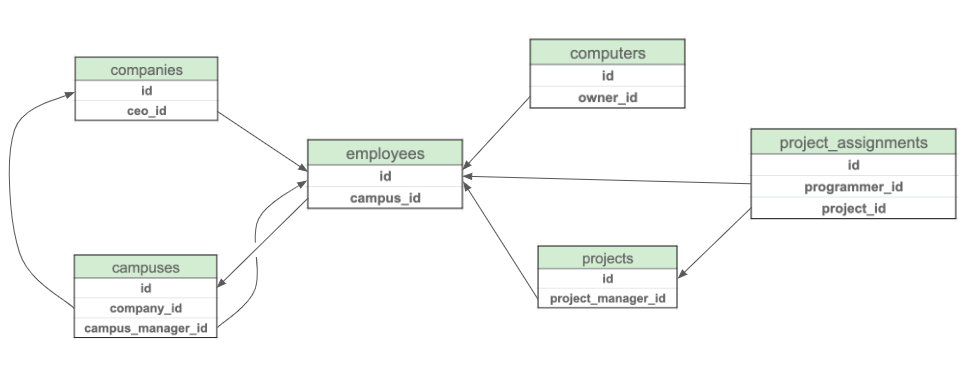

**Do not share this repo or post it publicly. We will take violations
very seriously.**

# Life at Google

We'll take **50min** for this part of the assessment.

**NB: Run `bundle install` before you get started.**

Next, set up the database:

  ./setup_db.sh

If you happen to have permission issues, try the following two commands:

  chmod +x ./setup_db.sh
  ./setup_db.sh

We have been tasked to develop an application for Google that will allow
them to keep track of programmers, managers, projects, campuses, and
computers for everybody who works at Google.

Your task today is to build the relationships between all of these
models. The database has already been setup and the models have been
annotated with their respective table schemas.

## Building Associations

The specs (`bundle exec rspec`) will guide you through building a
series of associations. Refer to the `db/schema.rb` file to find the
format of the database; this will especially help you find the name of
foreign keys.

I would start by building `has_many`, `belongs_to` and `has_one`
associations. I would later build the `has_many :through`
associations.

For any associations that requires any a non-default option, (i.e.
you have to specify `class_name`, `foreign_key`, `primary_key`, or
`source` for the association to work), please specify all options.

## Diagram/Brief Description

Make sure to be looking at the specs and the `db/schema.rb`. Part of
your job is to be able to understand the structure and interrelations
of the data from these sources.

(click on image to make it bigger)

We provide a brief overview. There are Employees (e.g., Jim). Employees
belong to a Company (Jim works at Google) and are assigned to work at a
specific Campus (an office location) at their Company (Jim works at the
Mountain View Campus at Google). A Company is led by a CEO (an
Employee), and a Campus is overseen by a campus manager (an Employee).

Employees are assigned to work on one or more Projects. The Project is
led by a project manager (an Employee).

Lastly, Employees have a Computer. Reflecting the personal bond between
Employee and Computer, a Employee has but a single Computer.

**Copyright App Academy, please do not post online**
